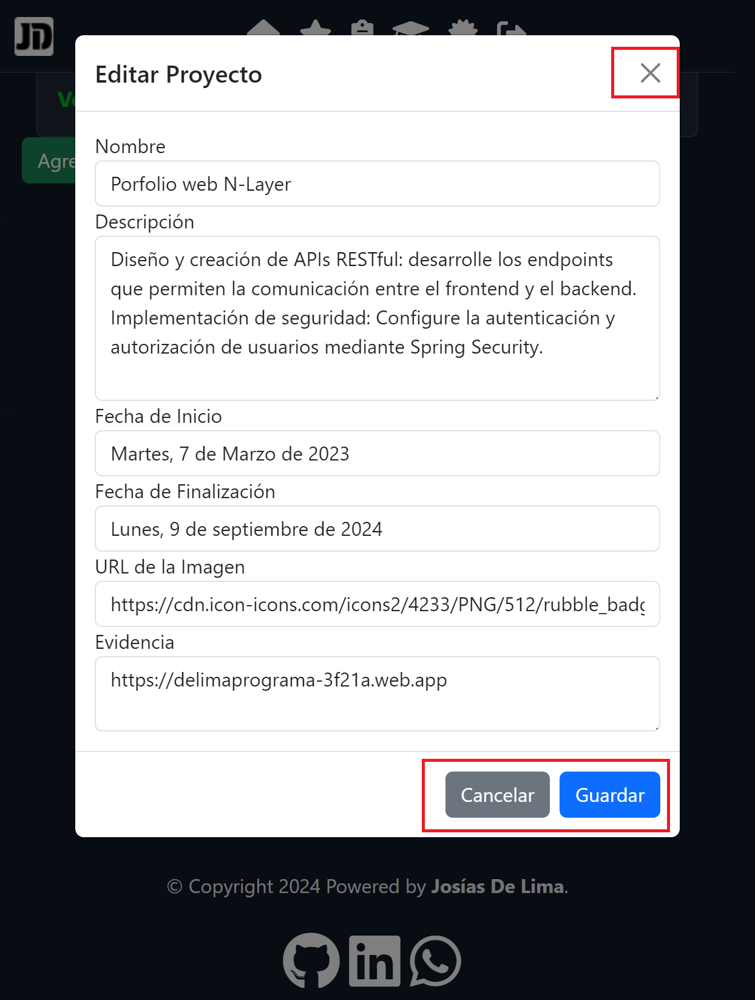

# 💻 Portfolio Web - #YoProgramo
 

En este repositorio se encuentra todo lo relacionado al **Frontend** del proyecto, en caso de querer ver la parte del **Backend** **[ir aquí](https://github.com/GermanDelima/BackEnd "aquí").**
## 📝 Descripción
- ***Portfolio Web Fullstack*** realizado como Proyecto Final del curso **Argentina Programa - #YoProgramo**.

- Se trata de la realización de una **Single Page Application (SPA)** realizada utilizando tecnologías como **HTML, CSS, Angular y Bootstrap**. Teniendo la primera versión en línea en el siguiente [enlace](https://delimaprograma-3f21a.web.app "enlace").

## ✅ Manejo de la App
Funcionalidades:
1. Ingresar con usuario y contraseña a través del apartado <b>"Ingreso"</b> en la barra de navegacion. dicho apartado posee un formulario reactivo con Validadores sincronizados (como requerir campos y verificar formatos) directamente en el código TypeScript. </b>, si todo sale bien nos permitirá editar los datos del perfil.

 
2. Como usuario se dispone de un <b>Portfolio Personal</b> , una vez ingresada a la cuenta de la manera indicada anteriormente, se puede modificar la información a través de los distintos elementos en la interfaz:

 

## ⌨🖱 Instalación
- Si queremos correr la aplicación en un entorno local debemos tener en cuenta lo siguiente: 

1. Clonar el repositorio utilizando GIT o descargando el archivo ZIP:

    `git clone https://github.com/GermanDelima/FrontEnd.git`

2. Instalar las dependencias a través de NPM.

    `npm install`

3. Configurar las variables de entornos en src/app/service/, donde en cada uno de los archivos .ts que aparecen deberemos cambiar la URL que tiene por   "http://localhost:8080"`

4. Compilar y montar el proyecto utilizando el comando `ng serve`

## 📩 Contacto
🙋🏻‍♂️Si te interesa ponerte en contacto conmigo podés hacerlo a través de:
**[LinkedIn ](https://www.linkedin.com/in/jos%C3%ADasgerm%C3%A1ndelima/) - [Github ](https://github.com/GermanDelima?tab=repositories)**
